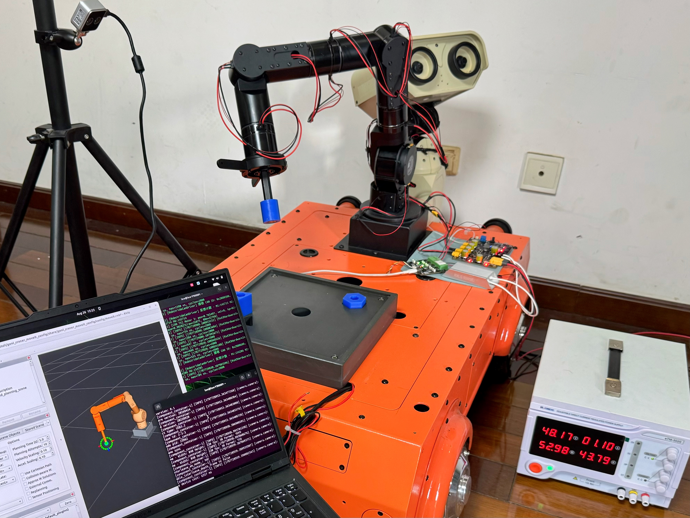
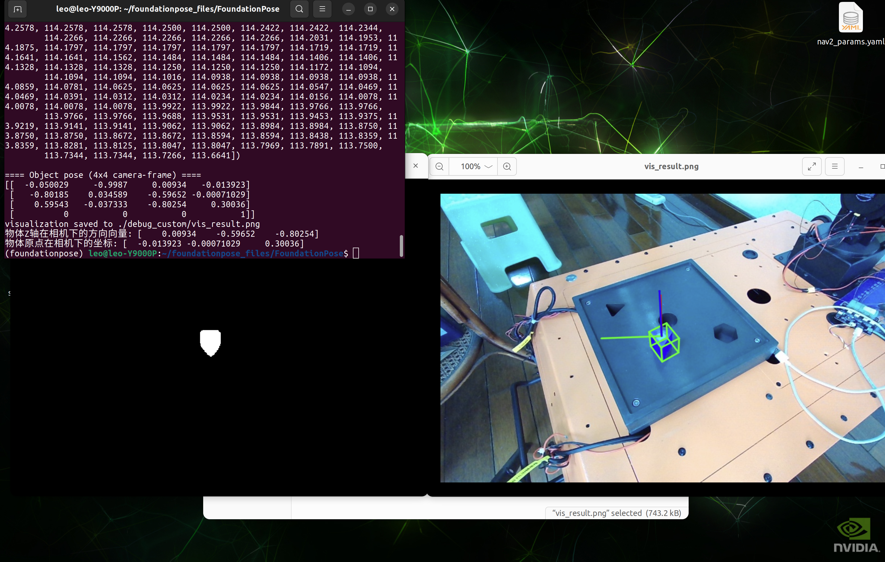
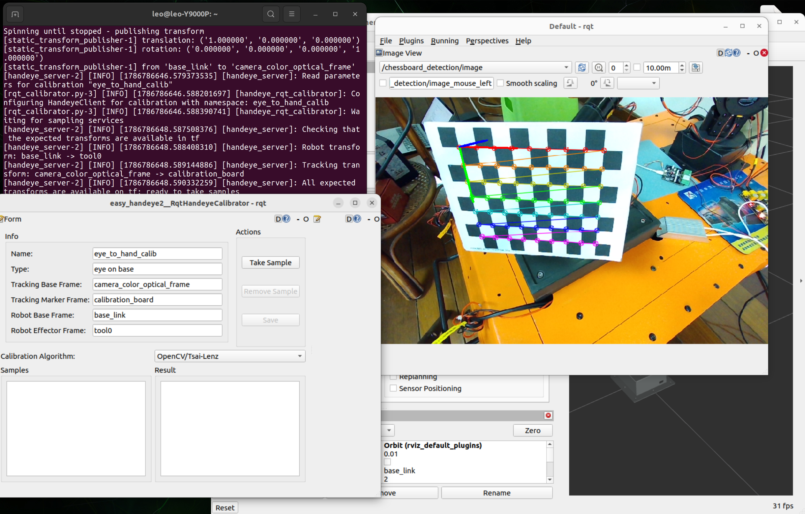

# GeniCraner: 7-DOF robot arm with YOLOv11-Seg + FoundationPose vision-based grasping

<div align="center">
  
  <p>GeniCraner (A 7‑DOF robot arm)</p>
</div>

A 7-degree-of-freedom robotic arm with an iron hex-socket (Allen key)
end-effector. Workpieces have magnets embedded inside, so the arm picks
them up by magnetic attraction on contact. Vision-based grasping uses
YOLOv11-Seg for instance segmentation and FoundationPose for 6D pose
estimation.

## Hardware

| Component | Details |
|---|---|
| Robot Arm | 7-DOF custom arm (GeniCraner) |
| Joint Motors | Robstride Dynamics: 1× RS06, 1× RS03, 5× RS00 |
| End-effector | Iron hex socket (Allen key); magnets embedded in workpieces |
| RGB-D Camera | Orbbec Gemini 305 |
| CAN Adapter | CANdle / gs_usb compatible device |
| Power Supply | 48V DC |
| Host | Ubuntu 22.04+x86_64, CUDA 12.1 |

## Zero-Torque Mode

Gravity-compensated free-drag mode for kinesthetic teaching and VLA data
collection. Implemented as a `ros2_control` controller using Pinocchio RNEA
for gravity compensation plus adaptive damping (Kp=0, so motors do not resist
manual movement).

```bash
# 1. Real robot arm + MoveIt 2 + RViz (all-in-one launch)
ros2 launch geni_craner_moveit_config real_robot.launch.py

# 2. Zero-torque mode (for VLA data collection / manual teaching)
ros2 control switch_controllers --deactivate joint_trajectory_controller --activate zero_torque_controller

# Return to normal trajectory control
ros2 control switch_controllers --deactivate zero_torque_controller --activate joint_trajectory_controller
```

## System Pipeline

```
RGB-D Camera
     │
     ▼
YOLOv11-Seg ──► object mask
     │
     ▼
FoundationPose ──► 6D pose (camera frame)
     │
     ▼
Hand-eye transform ──► 6D pose (base_link frame)
     │
     ▼
MoveIt 2 ──► motion plan & execute
     │
     ▼
Iron end-effector contacts magnet-embedded workpiece → magnetic pickup
```

## Reference Interfaces

The screenshots below are provided as a visual reference for the expected
appearance of the FoundationPose pose estimation and easy_handeye2 calibration
interfaces.

<table>
  <tr>
    <td align="center">
      
      <br /><strong>FoundationPose</strong> — 6D pose estimation
    </td>
    <td align="center">
      
      <br /><strong>Hand-eye Calibration</strong> — easy_handeye2
    </td>
  </tr>
</table>

## Repository Structure

```
geni_craner/
├── geni_craner_description/      # URDF/Xacro, STL meshes, display launch
├── geni_craner_hardware/         # ros2_control hw, Robstride Dynamics CAN driver,
│                                 # S-curve generator, zero-torque ctrl (C++)
├── geni_craner_moveit_config/    # MoveIt 2 config (SRDF, OMPL, controllers)
├── easy_handeye2/                # hand-eye calibration (eye-to-hand)
└── easy_handeye2_msgs/           # calibration message definitions
```

## Environment
- Ubuntu 22.04+x86_64
- ROS2 Humble (Python 3.10)
- SocketCAN · CAN 2.0 Extended Frame · 1 Mbps
- CUDA 12.1
- PyTorch 2.1.0, torchvision 0.16.0, torchaudio 2.1.0
- Ultralytics (YOLOv11)
- FoundationPose(https://github.com/NVlabs/FoundationPose)
- OrbbecSDK_ROS2 driver for Gemini 305
- Pinocchio (pip install pinocchio) — FK/IK/Gravity compensation

## Notes
- **YOLOv11-Seg model**: The trained weights (`*.pt`) are **not** included in this
  repository. You need to collect your own RGB-D images of the workpieces, annotate
  them with segmentation masks (e.g. using LabelMe), convert to YOLO format,
  and train the model yourself with Ultralytics.
- **FoundationPose**: Requires the target object's 3D mesh model as input. Prepare the
  mesh (e.g. from CAD / SolidWorks) and place it in the FoundationPose assets directory.
- **Hand-eye calibration**: Must be performed once for your specific camera mounting
  position using `easy_handeye2` before grasping can work.
- **Grasp strategy node**: This repository provides the robot control, MoveIt 2 planning,
  and low-level motion execution. The high-level grasp strategy node — which integrates
  YOLOv11-Seg + FoundationPose, converts the estimated 6D pose from camera frame to
  `base_link` frame via hand-eye calibration, and triggers grasp execution — is **not**
  included and must be implemented by the user according to their specific setup and
  workflow.
- **Two Python environments**: The ROS2 packages run on system Python 3.10,
  while YOLOv11-Seg and FoundationPose run in the `foundationpose` conda
  environment (Python 3.9). Do not mix them — install deep learning dependencies
  only in the conda environment, and build ROS2 packages with the system Python.

## Build

```bash
mkdir -p ~/geni_craner_ws/src && cd ~/geni_craner_ws/src
git clone https://github.com/nanj-robotics/geni_craner.git
cd ~/geni_craner_ws
rosdep install --from-paths src --ignore-src -r -y
colcon build --symlink-install
source install/setup.bash
```

## References
- FoundationPose: https://github.com/NVlabs/FoundationPose
- easy_handeye2: https://github.com/marcoesposito1988/easy_handeye2
- Robstride Dynamics: https://github.com/RobStride/EDULITE_A3
- Orbbec: https://github.com/orbbec/OrbbecSDK_ROS2
